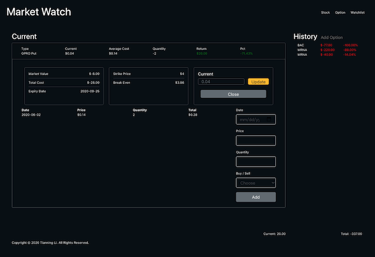

# Personal_Market_Watch

## Website

Front-end React.js website for display personal portfolio (stock & option).

## API

Back-end Python Flask API for storing stock and option portfolio.

| HTTP Method | URI | Action|
| ------------- | ------------- | ------------- |
| GET | http://[hostname]/api/history/all | get all the stock transactions |
| GET | http://[hostname]/api/history/[transaction_id] | get a stock transaction |
| POST | http://[hostname]/api/history/transaction | Create a new stock transaction |
| POST | http://[hostname]/api/history/transaction/[transaction_id] | Update an existing stock transaction 
| GET | http://[hostname]/api/option/all | get all the option transactions |
| GET | http://[hostname]/api/option/[transaction_id] | get a option transaction |
| POST | http://[hostname]/api/option/transaction | Create a new option transaction |
| POST | http://[hostname]/api/option/transaction/[transaction_id] | Update an existing option transaction 

## Running

For local run, React.js website normally run on http://localhost:3000 and Python Flask API run on http://localhost:5000 which will cause CORS errors, the project has already handle this by adding proxy in React.js package.json. 

## Screenshot

